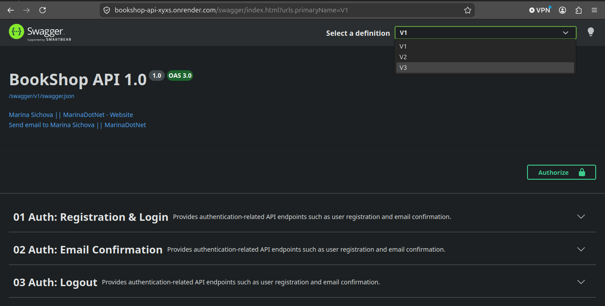
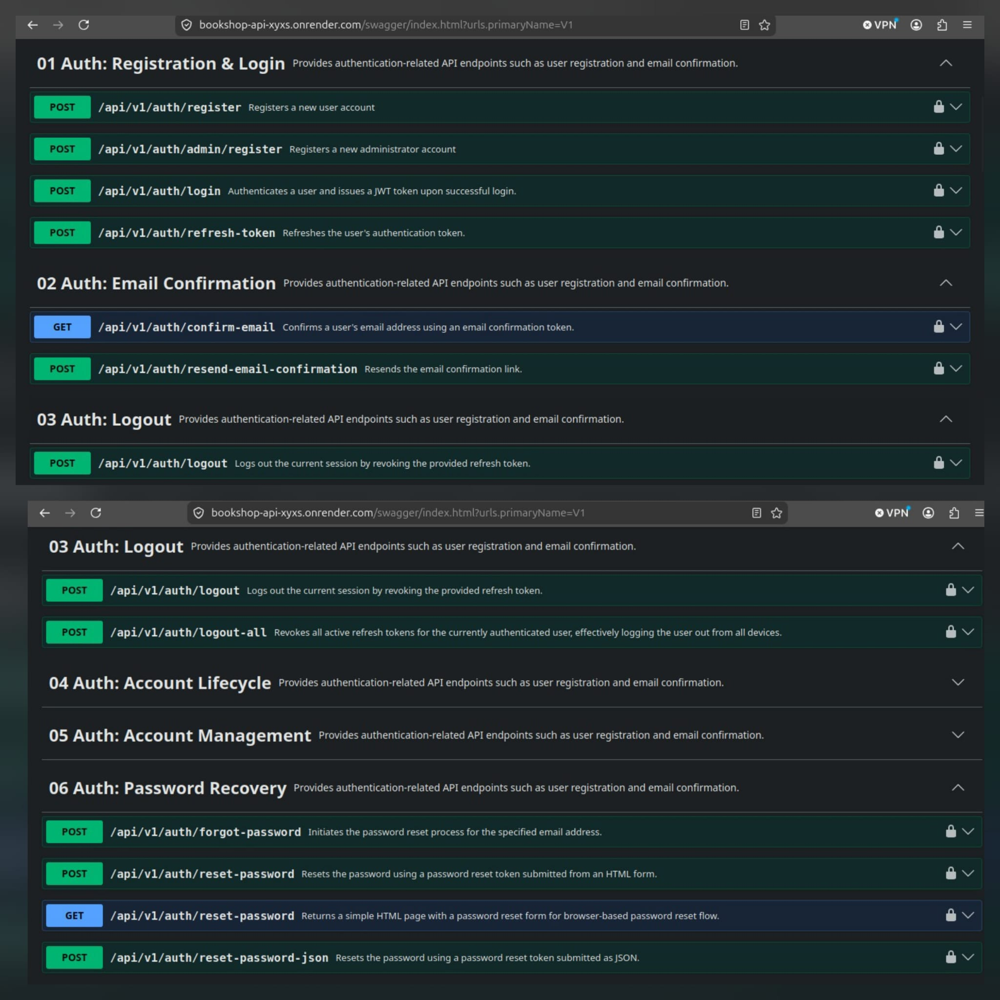
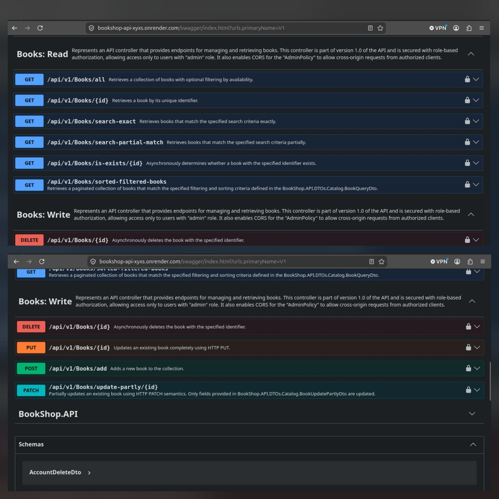
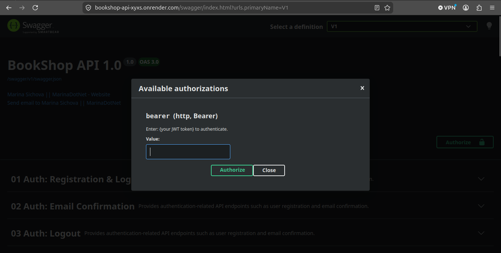
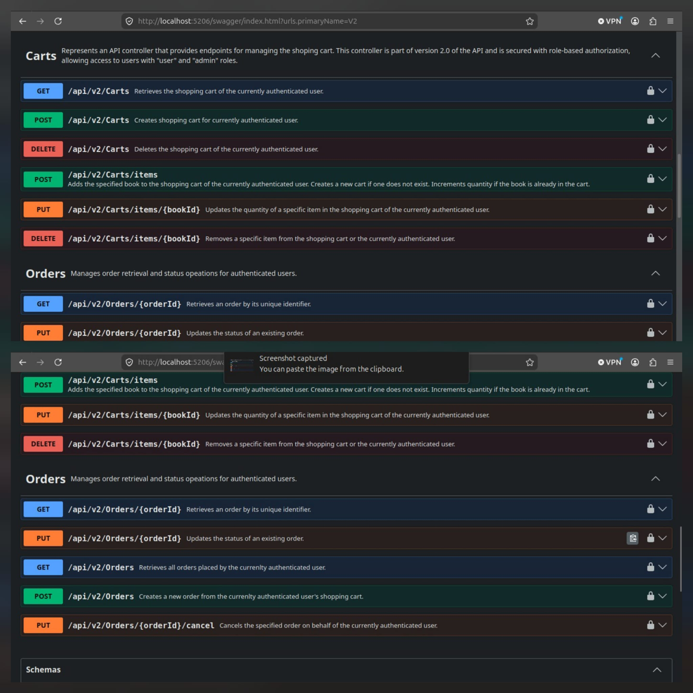
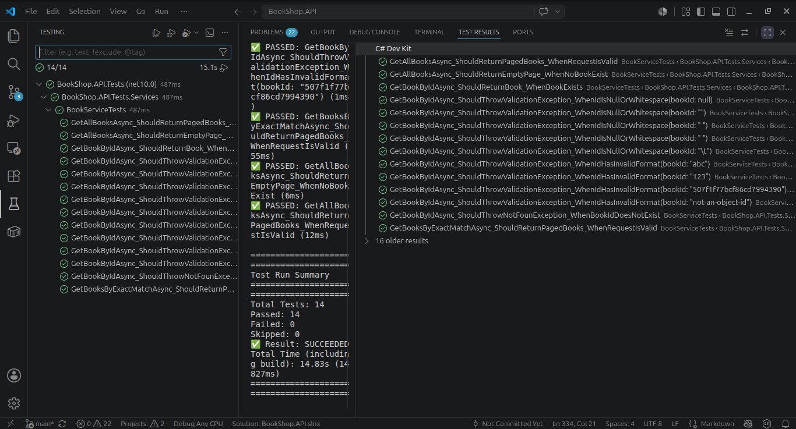

# BookShop.API

## ASP.NET Core REST API — Portfolio Project

**BookShop.API** is a RESTful Web API built with **ASP.NET Core**. The goal of this project is to demonstrate production-oriented backend development practices using ASP.NET Core.

> **Project Status**
> 🚧 Still in active development - adding new features and improving existing ones.

## Live Demo (Swagger)

🔗[BookShop.API Live](https://bookshop-api-xyxs.onrender.com/swagger/index.html)

---

## Architecture

BookShop.API is built using a layered architecture with Clean Architectrue princilples.

### Architectural patterns

- Layered (N-Tier) Architecture
- Repository Pattern
- Service Layer Pattern
- Dependency Injection
- DTO Pattern
- AutoMapper
- Centralized Exception Handling (ProblemDetails / RFC 7807)

### Design principles

- Separation of Concerns
- Dependency Inversion
- Single Responsibility Principle
- Interface-based abstractions

```
Client
    |
    ▼
Controllers
    |
    ▼
Services
    |
    ▼
Repositories
    |
    ▼
MongoDB / PostgreSQL

```

---

## Screenshots

### Swagger UI

The API is documented with Swagger/OpenAPI and organized into three API versions based on user access level. Each version exposes only the endpoints available to its intended audience.

<p align="center">
    
</p>

### Authentication

Supports registration, email confirmation, JWT authentication, refresh token rotation, account recovery, password reset, and logout from all devices.

<p align="center">
    
</p>

### Books API

Supports CRUD operations, exact and partial search, pagination, availability filtering, and API versioning with different access levels for administrators, authenticated users, and guests.

<p align="center">
    
</p>

### Authorization

Swagger is configured with JWT Bearer authentication, allowing authenticated endpoints to be tested directly from the browser.

<p align="center">
    
</p>

### Shopping Cart and Orders

Provides shopping cart management and order creation for authenticated users.

<p align="center">
    
</p>

### Unit Tests

The business layer is covered with unit tests using xUnit, Moq, and FluentAssertions to verify business logic, validation, exception handling, and interaction between application components.

<p align="center">
    
</p>

---

## What This Project Shows

I built this to practice and demostrate skills that matter for a Junior .NET Backend Developer:

- Building REST APIs with clear structure and versioning
- Layered architecture with proper separation of concerns
- Full JWT authentication with refresh token rotation
- Email confirmation and account management flows
- Working with both MongoDB and PostgreSQL in the project
- Custom exception handling with RFC 7807 ProblemDetails
- Containerized with Docker and deployed on Render.
- Request validation using Data Annotations and FluentValidation
- Shopping cart and order management
- Endpoint-specific rate limiting using ASP.NET Core RateLimiter

---

## Tech Stack

- ASP .NET Core Web API (.NET 10)
- Entity Framework Core + PostgreSQL (users and auth and orders)
- MongoDB (books catalog and cart)
- JWT Bearer Authentication + Refresh Tokens
- ASP .NET Core Data Protection (auth action tokens)
- Brevo (transactional email)
- AutoMapper
- ASP.NET Core Rate Limiting
- FluentValidation
- xUnit
- Moq
- FluentAssertions
- Swagger / OpenAPI (with XML documentation)
- Docker
- Render.com (deployment)
- CancellationToken support accross controllers, services, and repositories

---

## API Versioning

Instead of versioning by feature, I versioned by **who can access what**:

| Version | Who can use it | Controllers |
|---------|----------------|-------------|
| **V1** | Admins only | `AuthController`, `BooksController` |
| **V2** | Logged in users | `BooksController`, `CartsController`, `OrdersController` |
| **V3** | Guests / not logged in | `BooksController` |

This keeps authorization logic clear at the routing level and makes access boundaries explicit.

---

## Authentication & Security

The auth system is one of the main focuses of this project. It includes:

- **Registration** with email confirmation (resend with 3-minute cooldown)
- **Login** with JWT access token + refresh token pair
- **Refresh token rotation** - old token is revoked and replaced on every refresh
- **Reuse detection** - if a revoked token is used again, all sessions for that user are invalidated
- **Logout** (single session) and **logout from all devices**
- **SecurityTokenInvalidBeforeUtc** - when password changes or user logs out from all devices, all existing JWT tokens become invalid immediately, even before they expire
- **Password reset** via email link (with HTML form for browser flow and JSON endpoint for API clients)
- **Email change** with confirmation to the new address
- **Account deletion** with email confirmation
- **Account recovery** for soft-deleted accounts
- **Soft delete** - users are never removed from the database
- **Sliding Window rate limiting** - endpoint-specific rate limiting to protect authentication and public endpoints

---

## Validation

The API uses a layered validation approach.

- **ASP.NET Core Model Validation** (Data Anotations) validates incoming request models during model binding and authoamtically returns `400 Bad Request` responses for invalid requests.
- **FluentValidation** is used for business validation rules that belong to the application layer.
- Validation failures are returned as standardized **RFC 7807 ProblemDetails** responses.

---

## Project Structure

```
BookShop.API
|
├── Controllers
|  ├── V1
|  |  ├── AuthController.cs          ← Admin + public auth endpoints
|  |  └── BooksController.cs         ← Full CRUD (admin only)
|  ├── V2
|  |  ├──BooksController.cs          ← Read all available books (logged in users)
|  |  ├──CartController.cs
|  |  └──OrderController.cs
|  ├── V3
|  |  └── BooksController.cs         ← Top 10 cheapest books (guests)
|  └── BaseApiController.cs          ← Shared base with GetCurrentUserId()
|
├── DTOs
|  ├── Auth
|  |  ├── UserRegisterDto.cs
|  |  ├── UserLogin Dto.cs
|  |  ├── UserDto.cs
|  |  ├── LoginResultDto.cs
|  |  ├── LogoutDto.cs
|  |  ├── AccountDeleteDto.cs
|  |  ├── AccountRequestDto.cs
|  |  ├── EmailDto.cs
|  |  ├── ForgotPasswordDto.cs
|  |  ├── ResendEmailConfirmationDto.cs
|  |  ├── ResetPasswordDto.cs
|  |  ├── UpdateEmailDto.cs
|  |  ├── UpdatePasswordDto.cs
|  |  └── UpdateUserNameDto.cs
|  ├── Catalog
|  |  ├── AddToCartDto.cs
|  |  ├── BookCreateDto.cs
|  |  ├── BookDto.cs
|  |  ├── BookQueryDto.cs
|  |  ├── BookSearchRequestDto.cs
|  |  ├── BookUpdateDto.cs
|  |  ├── BookUpdatePartlyDto.cs
|  |  ├── CartDto.cs
|  |  ├── CartItemsDto.cs
|  |  └── UpdateItemQuantityDto.cs
|  ├──Order
|  |  ├── OrderDto.cs
|  |  └── OrderItemDto.cs
|  └── Shared
|  |  ├── PageResultDto.cs
|  |  └── PaginationQueryDto.cs
|
├── Exceptions
|  ├── ConflictException.cs
|  ├── ForbiddenException.cs
|  ├── InvalidTokenException.cs
|  ├── NotFoundExcekption.cs
|  └── ValidationException.cs
|
├── Helpers
|  ├── PaginationHelper.cs
|  └── ValidationExtensions.cs
|
├── Infrastructure
|  ├── Persistence
|  |  ├── AuthDbContext.cs           ← EF Core context for PostgreSQL
|  |  ├── BaseMongoDbContex.cs
|  |  ├── CartMongoDbSettings.cs
|  |  ├── MongoDbContext.cs          ← MongoDB context for books
|  |  ├── MongoDbSettings.cs
|  |  ├── OrderDbContext.cs
|  |  └── UpdateDefinitionExtensions.cs
|  ├── AppUrlOptions.cs
|  ├── BrevoAuthEmailSender.cs
|  ├── BrevoOptions.cs
|  ├── ConfigurationSwaggerOptions.cs
|  ├── JwtOptions.cs
|  └── RateLimiterExtensions.cs
|
├── Mappings
|  ├── BookMappingProfile.cs
|  ├── CartMappingProfile.cs
|  ├── OrderMappingProfile.cs
|  └── UserMappingProfile.cs
|
├── Middleware
|  ├── ExceptionHandlingMiddleware.cs
|  └── ProblemDetailsBuilder.cs
|
├── Migrations
|  └── OrderMigrations
|
├── Models
|  ├── Auth
|  |  ├── AuthTokens.cs              ← Token purposes + payload model
|  |  ├── RefreshToken.cs
|  |  ├── Role.cs
|  |  ├── User.cs
|  |  └── UserRole.cs
|  ├── Catalog
|  |  ├── Book.cs
|  |  ├── Cart.cs
|  |  └── Item.cs
|  ├── Order
|  |  ├── Order.cs
|  |  ├── OrderItem.cs
|  |  └── OrderStatus.cs
|
├── Repositories
|  ├── BookRepository.cs
|  ├── CartRepository.cs
|  ├── IBookRepository.cs
|  ├── ICartRepository.cs
|  ├── IOrderRepository.cs
|  ├── IUserRepository.cs
|  ├── OrderRepository.cs
|  └── UserRepository.cs
|
├── Services
|  ├── AuthLinkGenerator.cs
|  ├── AuthServices.cs
|  ├── AuthTokenService.cs
|  ├── BookService.cs
|  ├── CartService.cs
|  ├── IAuthEmailSender.cs
|  ├── IAuthLinkGenerator.cs
|  ├── IAuthTokenService.cs
|  ├── IBookService.cs
|  ├── ICartService.cs 
|  ├── IJwtTokenService.cs
|  ├── IOrderService.cs
|  ├── IRefreshTokenGenerator.cs
|  ├── IRefreshTokenHasher.cs
|  ├── JwtTokenService.cs
|  ├── OrderService.cs
|  ├── RefreshTokenGenerator.cs
|  └── RefreshTokenHasher.cs
|
├── Validators
|  ├── AddToCartValidator.cs
|  ├── BookCreateValidator.cs
|  ├── BookQueryValidator.cs
|  ├── BookUpdatePartlyValidation.cs
|  ├── BookUpdateValidator.cs
|  ├── ForgotPasswordValidator.cs
|  ├── PaginationQueryValidator.cs
|  ├── ResetPasswordValidator.cs
|  ├── UpdateItemQuantityValidator.cs
|  ├── UpdatePasswordValidator.cs
|  ├── UpdateUserNameValidator.cs
|  ├── UserLoginValidator.cs
|  └── UserRegisterValidator.cs
|
├── Program.cs
├── appsettings.json
├── appsettings.Development.json
├── Dockerfile
|
BookShop.API.Tests
|
├── Services
|  ├── BookServiceTests.cs
```

---

## How It's Organized

**Controllers** handle HTTP only - no business logic, no direct data access.

**Services** contain all business logic. Every service has an interface. `AuthServices` is the main one - it handles everyting from registration to account recovery.

**Repositories** handle data access only. Books live in MongoDB, users and tokens live in PostgreSQL. Both sides have interface.

**DTOs** are the API contracts - separate from domain models, organized by Auth and Catalog.

**Middleware** catches all unhandled exceptions and converts them into consistent RFC 7807 `ProblemDetails` responses. The mapping from exception type to HTTP status code lives in `ProblemDetailsBuilder`.

**Infrastructure** holds database contexts, configuration options, email sending, and Swagger setup.

**Auth tokens** (email confirmation, password reset, etc.) use ASP .NET Core Data Protection - the are not JWT tokens. They are purpose-bound, time-limited, and Base64URL-encoded.

**Validation** is split across layers. Request models are validated by ASP.NET Core model binding using Data Annotations, while business-specific validation is handled with FluentValidation.

**Rate Limitting** uses ASP.NET Core's built-in RateLimiter middleware with endpoint-specific policies. Different limits are applied to authentication, catalog, and public endpoints to reduce abuse while allowing normal application usage.

---

## Database Design Highlights

**PostgreSQL (via EF Core):**
- Soft delete with `IsDeleted` flag and query filter so deleted users are invisible by default
- Partial unique indexes on `NormalizedEmail` and `NormalizedUsername` filtered by `IsDeleted = false` - so a deleted user's email can be reused after account recovery
- `SecurityTokenInvalidBeforeUtc` timestamp for instant JWT invalidation without a token blacklist

**MongoDB:**
- Books catalog stored in MonogDB wiht case-insensitive regex search
- Shopping cart persistence
- Partial document updates using UpdateDefinition builders

---
## Pagination

Pagination is supported for catalog and search endpoints. Pagination requests are validated automatically using ASP.NET Core model validation before reaching the service layer.

### Query Parameters
| Parameter  | Description | Default |
|---|---|---|
| pageNumber | The page number to retrieve | 1 |
| pageSize | Nuber of items returned per page | 10 |

### Maximum Page Size

The API limits the maximum page size to `100`.

---

## Unit Tests

The solution includes unit tests focused on the business layer.

Current coverage includes:

- BookService
- xUnit
- Moq
- FluentAssertions

More service-level tests will be added as new features are completed.

---

## Planned Improvements

- Increase unit test coverage
- Redis caching for shopping cart
- Integration tests
- CI/CD with GitHub Actions
- Structured logging
- Response caching

---


